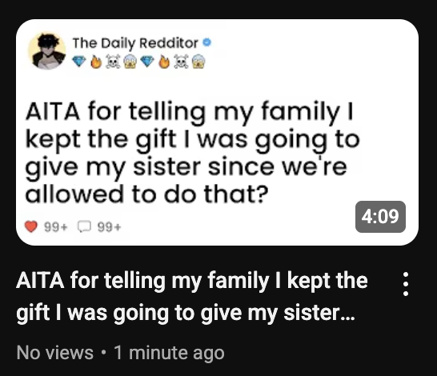
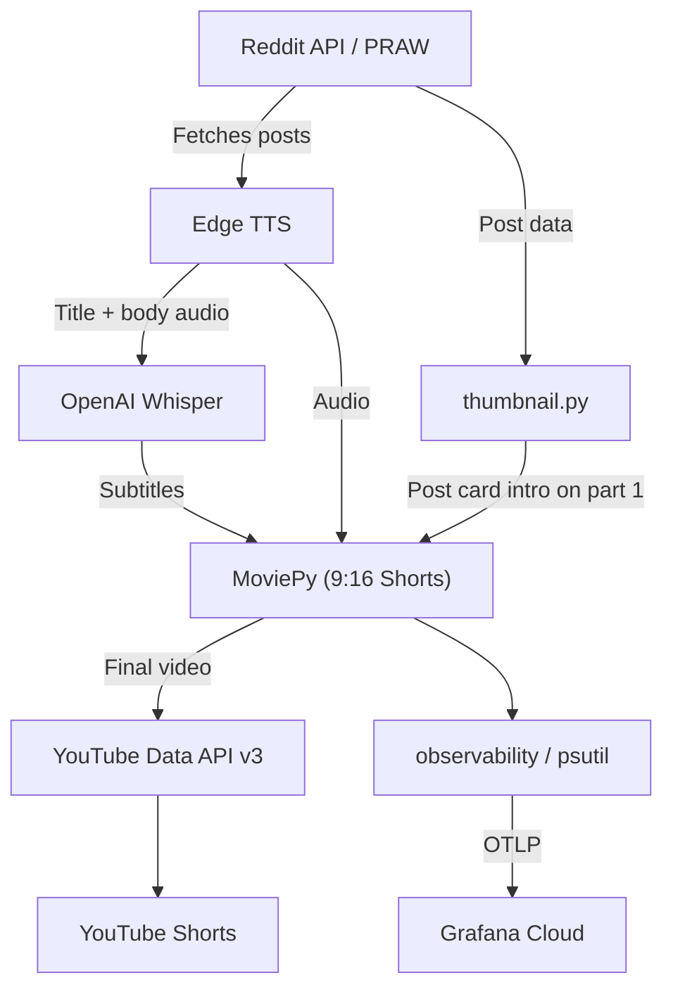

# reddit-tts-video

## Project Description

**Reddit TTS Video** is an automated pipeline that turns top Reddit posts into **YouTube Shorts** — vertical 9:16 videos with TTS narration, TikTok-style subtitles, a Reddit post-card intro thumbnail, and direct upload to YouTube.

Built with Python, Edge TTS, OpenAI Whisper, MoviePy, and the YouTube Data API v3. In production, every run exports metrics, traces, and logs to **Grafana Cloud** via **OpenTelemetry**.

[Demo of Example Video Generated](https://www.youtube.com/watch?v=ENCQAaIP8nE):



## What it produces

Each run fetches Reddit submissions and outputs **Shorts-ready** `.mov` files (1080×1920, up to 3 minutes). Long posts are split into multiple parts automatically.

| Step | What happens |
|------|----------------|
| **Fetch** | Top posts from configured subreddits via PRAW |
| **Narrate** | Edge TTS for title + body (`en-US-GuyNeural` by default) |
| **Thumbnail intro** | `thumbnail.py` renders a Reddit-style post card (Pillow) and fades it in at the start of part 1 |
| **Subtitles** | Whisper transcription, rechunked into short word bursts, burned into the video |
| **Render** | MoviePy composes 9:16 footage, audio, SFX, and the intro card |
| **Upload** | YouTube Data API with Shorts tags, `#Shorts`, and subreddit hashtags |

## Pipeline overview


```mermaid
flowchart TD
    RedditAPI["Reddit API / PRAW"] -->|Fetches posts| TTS["Edge TTS"]
    RedditAPI -->|Post data| ThumbnailCard["thumbnail.py"]
    TTS -->|Title + body audio| Whisper["OpenAI Whisper"]
    TTS -->|Audio| MoviePy["MoviePy (9:16 Shorts)"]
    ThumbnailCard -->|Post card intro on part 1| MoviePy
    Whisper -->|Subtitles| MoviePy
    MoviePy -->|Final video| YouTubeAPI["YouTube Data API v3"]
    MoviePy --> Metrics["observability / psutil"]
    Metrics -->|OTLP| Grafana["Grafana Cloud"]
    YouTubeAPI --> Shorts["YouTube Shorts"]
```

## Observability (Grafana + OpenTelemetry)

Production runs (`DEBUG = False`) always export to Grafana Cloud over OTLP. Each run also emits structured JSON metrics to stdout (phase duration, CPU, memory).

| Signal | Examples |
|--------|----------|
| **Metrics** | Phase duration, CPU/memory every 1s, upload success/errors |
| **Traces** | One span per pipeline phase |
| **Logs** | All pipeline logger output |

OTEL is on by default in `configs/youtube_config.yaml` (`metrics.otel.enabled: true`). Production and CI need Grafana credentials in `.env` or GitHub Actions secrets (never commit keys):

```bash
OTEL_EXPORTER_OTLP_ENDPOINT=https://otlp-gateway-<region>.grafana.net/otlp
OTEL_EXPORTER_OTLP_HEADERS=Authorization=Basic <token>
```

Set `DEBUG = True` in `config.py` only for local dev — that skips OTEL export and uses development Reddit sources. Full setup: [`observability/README.md`](observability/README.md).

## Development

Install git hooks once (ruff/mypy on commit, commitlint on commit message):

```bash
bash scripts/setup-pre-commit.sh
```

Commit messages follow [Conventional Commits](https://www.conventionalcommits.org/); body lines must stay within **100 characters** (same rule as CI). To check commits on your branch before pushing:

```bash
bash scripts/validate-commits.sh
```

Run locally:

```bash
pip install -r requirements.txt
python3 main.py
```

---

## 📺 Watch on YouTube

[Visit TheDailyRedditor channel](https://www.youtube.com/@TheDailyRedditors)

---

## 🙏 Credits & Attributions

- Reddit, YouTube, and other brand logos are trademarks of their respective owners.
- Icons and images used in this project from Flaticon:
  - [❤️ Heart](https://www.flaticon.com/free-icon/heart_520428?term=heart&page=1&position=45&origin=search&related_id=520428)
  - [😱 Shocked](https://www.flaticon.com/free-icon/shocked_983019?term=shocked&page=1&position=1&origin=search&related_id=983019)
  - [🔥 Fire](https://www.flaticon.com/free-icon/fire_17702109?term=fire+emoji&page=1&position=14&origin=search&related_id=17702109)
  - [💀 Skull](https://www.flaticon.com/free-icon/skull_6980939?term=skull&page=1&position=27&origin=search&related_id=6980939)
  - [✔️ Verified](https://www.flaticon.com/free-icon/verified_7641727?term=verified&page=1&position=2&origin=tag&related_id=7641727)
  - [💎 Diamond](https://www.flaticon.com/free-icon/diamond_408421?term=diamond&page=1&position=17&origin=search&related_id=408421)

---
