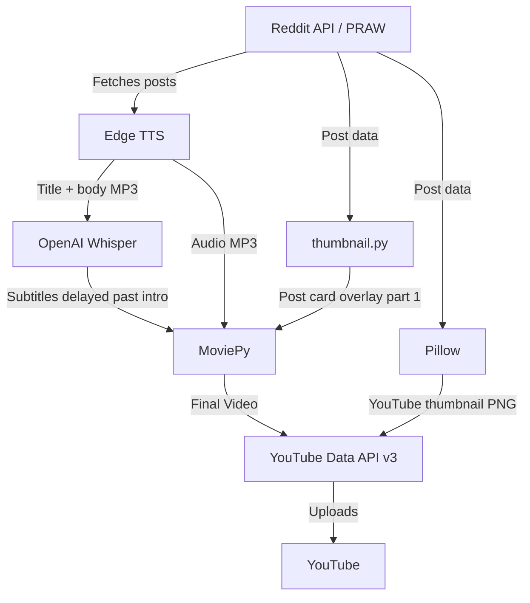

# reddit-tts-video

## Project Description

reddit-tts-video is an automated pipeline that fetches top Reddit posts, converts them to narrated videos with subtitles and custom thumbnails, and uploads them to YouTube. It leverages Python, gTTS, OpenAI Whisper, MoviePy, Pillow, and the YouTube Data API v3 to create engaging automated content from Reddit stories with minimal manual intervention.

[Demo of Example Video Generated](https://www.youtube.com/watch?v=ENCQAaIP8nE):


## Application Process Overview

The following flowchart illustrates the end-to-end process, from fetching Reddit content to uploading the final video and thumbnail to YouTube:


```mermaid
flowchart TD
    RedditAPI[Reddit API / PRAW] -->|Fetches posts| TTS[Edge TTS]
    RedditAPI -->|Post data| ThumbnailCard[thumbnail.py]
    RedditAPI -->|Post data| Pillow[Pillow]
    TTS -->|Title + body MP3| Whisper[OpenAI Whisper]
    TTS -->|Audio MP3| MoviePy[MoviePy]
    ThumbnailCard -->|Post card overlay part 1| MoviePy
    Whisper -->|Subtitles delayed past intro| MoviePy
    MoviePy -->|Final Video| YouTubeAPI[YouTube Data API v3]
    Pillow -->|YouTube thumbnail PNG| YouTubeAPI
    YouTubeAPI -->|Uploads| YouTube[YouTube]
```

---

## Development

Install git hooks once (ruff/mypy on commit, commitlint on commit message):

```bash
bash scripts/setup-pre-commit.sh
```

Commit messages follow [Conventional Commits](https://www.conventionalcommits.org/); body lines must stay within **100 characters** (same rule as CI). To check commits on your branch before pushing:

```bash
bash scripts/validate-commits.sh
```

---

## 📺 Watch on YouTube

[Visit TheDailyRedditor channel](https://www.youtube.com/@TheDailyRedditors)

---

## 🙏 Credits & Attributions

- Reddit, YouTube, and other brand logos are trademarks of their respective owners.
- Icons and images used in this project from Flaticon:
  - [❤️ Heart](https://www.flaticon.com/free-icon/heart_520428?term=heart&page=1&position=45&origin=search&related_id=520428)
  - [😱 Shocked](https://www.flaticon.com/free-icon/shocked_983019?term=shocked&page=1&position=1&origin=search&related_id=983019)
  - [🔥 Fire](https://www.flaticon.com/free-icon/fire_17702109?term=fire+emoji&page=1&position=14&origin=search&related_id=17702109)
  - [💀 Skull](https://www.flaticon.com/free-icon/skull_6980939?term=skull&page=1&position=27&origin=search&related_id=6980939)
  - [✔️ Verified](https://www.flaticon.com/free-icon/verified_7641727?term=verified&page=1&position=2&origin=tag&related_id=7641727)
  - [💎 Diamond](https://www.flaticon.com/free-icon/diamond_408421?term=diamond&page=1&position=17&origin=search&related_id=408421)

---
