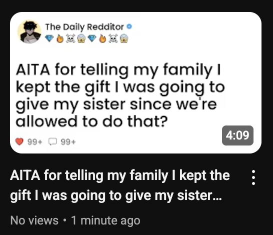
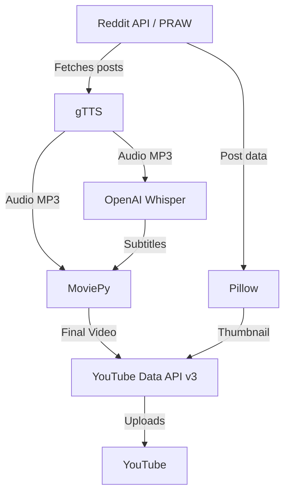

# reddit-tts-video

## Project Description

reddit-tts-video is an automated pipeline that fetches top Reddit posts, converts them to narrated videos with subtitles and custom thumbnails, and uploads them to YouTube. It leverages Python, gTTS, OpenAI Whisper, MoviePy, Pillow, and the YouTube Data API v3 to create engaging automated content from Reddit stories with minimal manual intervention.

[Demo of Example Video Generated](https://www.youtube.com/watch?v=ENCQAaIP8nE):

## Application Process Overview

The following flowchart illustrates the end-to-end process, from fetching Reddit content to uploading the final video and thumbnail to YouTube:

---

## 📺 Watch on YouTube

[Visit TheDailyRedditor channel](https://www.youtube.com/@TheDailyRedditors)

---

## 🙏 Credits & Attributions

- Reddit, YouTube, and other brand logos are trademarks of their respective owners.
- Icons and images used in this project from Flaticon:
  - [❤️ Heart](https://www.flaticon.com/free-icon/heart_520428?term=heart&page=1&position=45&origin=search&related_id=520428)
  - [😱 Shocked](https://www.flaticon.com/free-icon/shocked_983019?term=shocked&page=1&position=1&origin=search&related_id=983019)
  - [🔥 Fire](https://www.flaticon.com/free-icon/fire_17702109?term=fire+emoji&page=1&position=14&origin=search&related_id=17702109)
  - [💀 Skull](https://www.flaticon.com/free-icon/skull_6980939?term=skull&page=1&position=27&origin=search&related_id=6980939)
  - [✔️ Verified](https://www.flaticon.com/free-icon/verified_7641727?term=verified&page=1&position=2&origin=tag&related_id=7641727)
  - [💎 Diamond](https://www.flaticon.com/free-icon/diamond_408421?term=diamond&page=1&position=17&origin=search&related_id=408421)

---
